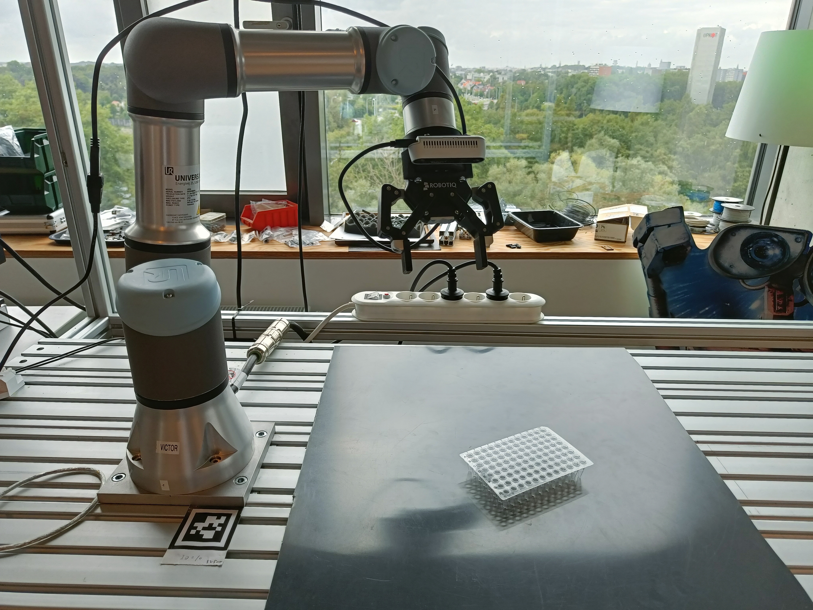
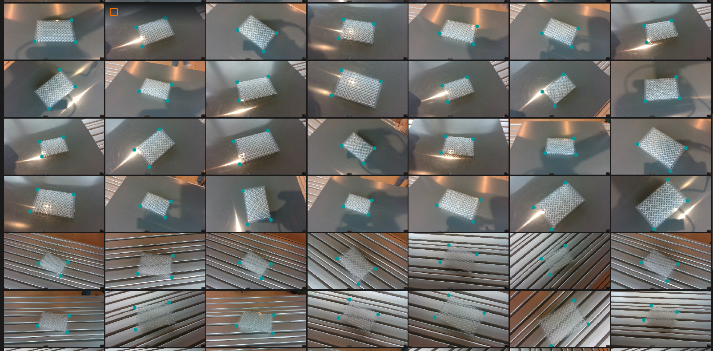
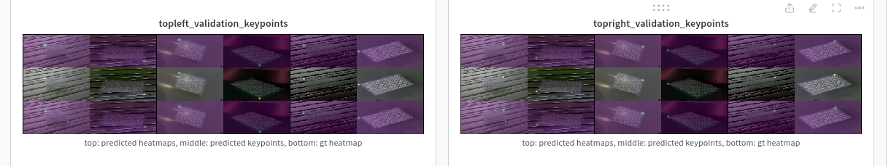

# Pose estimation & grasping of a microplate

scope: minimal human effort, single-category grasping of an object with varied 3D pose (3D variations, even though you could argue that the microplate will always lie flat on the surface) using a robot arm and realsense depth camera.

This boils down to 6D Pose estimation and defining a grasp pose in the frame of the object.

### Keypoint-based

3 points can define a frame and hence one can perform pose estimation of an object by detecting three semantic 3D keypoints. 

Obtaining 3D keypoints can be done with:
- 3D keypoint detection in pointclouds/depth images (requires depth camera)
- 2D keypoint detection + reprojection using depth map (requires depth camera and only works for keypoints that are visible and on the surface of the object)
- 2D keypoint detection from multiple views with multi-view triangulation. (obtaining multiple views requires multiple fixed cameras or moving the robot to different poses with a wrist camera)

We take the third approach as the microplate is rather transparent, which makes it challenging to obtain a good depth image, even with active light approaches such as used by the realsense.

For multiview triangulation, or the process of combining kwown camera intrinsics/extrinsics with 2D keypoints to obtain the 3D position, we use the midpoint algorithm as it has an analytical solution. 

The intrinsics are factory-calibrated on the realsense, for the extrinsics we have to do eye-in-hand calibration. This is implemented in the airo-camera-toolkit, using opencv functionality and charuco board. 

To obtain the 2D labels for the keypoints, we have to collect images and label them. The simplest approach is to take images with a camera from random poses and label them manually, e.g. using CVAT. However, we can exploit the known camera intrinsics to collect the images with the robot arm (so that we known the camera pose for each image). Then, for each static scene, we can label 3-4 images, obtain the 3D position and project back to all other images. 

A video of the robot collecting the images can be found [here](https://photos.app.goo.gl/scdrSa6akqA112L8A).

We can e.g. collect 35 images per scene and only have to label 4 of them. By gathering images for 5 scenes, with different poses of the microplate and with 2 different surfaces, a dataset of 175 images was obtained with minimal label effort. Labeling these 5x4 images takes only a few minutes.

We convert the labels to the coco format for the keypoint detector and then train the keypoint detector (which takes about 10 minutes on an RTX 3090). We use a single-view keypoint detector that processes each view separately ('late fusion')

Now we can detect the keypoints, infer the pose and have the robot interact with the microplate.

One note: the triangulation has errors up to 5mm, probably due to imperfect calibration. 
### 6D Pose estimation
Todo

